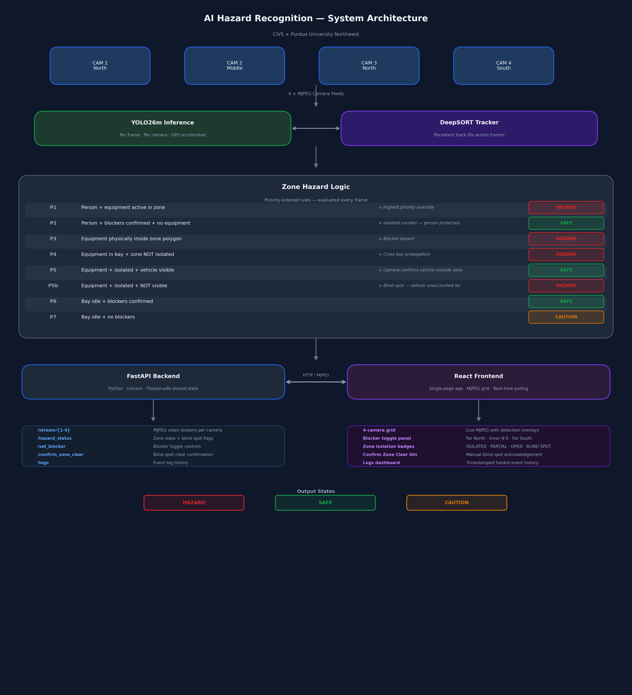

# AI Hazard Recognition

**Real-Time Industrial Safety Monitoring with YOLO26m and Zone-Based Hazard Logic**

*CIVS × Purdue University Northwest · SDI Butler Steel Plant Research*

[](https://www.python.org/)
[](https://react.dev/)
[](https://github.com/ultralytics/ultralytics)
[](LICENSE)

---

## Overview

This system performs real-time hazard detection across a four-camera bay using a custom-trained YOLO26m model, a zone-based safety logic engine, and a React dashboard. It was developed for research at a steel plant melt shop bay where simultaneous operation of heavy vehicles (pot haulers) and ground personnel presents critical safety risks.

The system classifies each frame into a **three-state traffic light** (SAFE / CAUTION / HAZARD) per zone, with support for physical blocker isolation, vehicle blind spot memory, and manual zone clear confirmation.



---

## Key Features

- **Custom YOLO26m model** — 4-class detector: `person`, `pot_blocking`, `pot_hauler`, `pot_not_blocking`
- **Zone-based 5-rule priority hazard logic** — evaluates safety state per zone considering equipment activity, personnel presence, and physical blockers
- **4-camera MJPEG streaming** — wall-clock synchronized playback at 8 FPS with gamma correction and sharpness filtering
- **Physical blocker isolation model** — 4 blockers (Far North, Inner North, Inner South, Far South) define 3 safety zones: Zone A (north bay, Cam 1+3), Zone B (middle, Cam 2), Zone C (south entrance, Cam 4)
- **Vehicle blind spot memory** — detects when heavy equipment enters a camera blind spot; keeps zone flagged as HAZARD until manually confirmed clear
- **Cross-camera bay hazard propagation** — a vehicle active in any camera of a zone propagates HAZARD state to all cameras in that zone
- **DeepSORT multi-object tracking** — optional tracker for consistent object IDs across frames
- **Event logger + logs dashboard** — real-time event timestamping, camera-level playback controls, and history view
- **VLM reasoning page** — optional integration for natural language hazard explanation via local Gemma 3 or Gemini API


## Repository Structure

```
ai-hazard-recognition/
├── backend/
│   ├── main.py                 ← FastAPI app: API routes, streaming endpoints
│   ├── stream_generator.py     ← MJPEG frame generator, YOLO26m inference loop
│   ├── hazard_logic.py         ← 5-rule zone safety evaluation engine
│   ├── zone_sync_manager.py    ← Cross-camera bay hazard propagation
│   ├── deepsort_tracker.py     ← DeepSORT multi-object tracker wrapper
│   ├── adaptive_deblur.py      ← Gamma correction + sharpness filter
│   ├── polygon_utils.py        ← Zone polygon intersection helpers
│   ├── polygon_1-4.json        ← Camera zone polygon definitions
│   ├── event_logger.py         ← Hazard event timestamping
│   ├── logs_api.py             ← Event log API endpoints
│   ├── live_ws.py              ← WebSocket live state endpoint
│   ├── hazard_reason.py        ← VLM hazard explanation (optional)
│   ├── video_utils.py          ← Video preprocessing utilities
│   ├── train_yolo26m.py        ← YOLO26m training script
│   ├── eval_baseline.py        ← Evaluation: baseline model
│   ├── eval_new.py             ← Evaluation: updated model
│   ├── paper_eval.py           ← Evaluation metrics for research
│   └── requirements.txt        ← Python dependencies
├── frontend/
│   ├── src/
│   │   ├── App.js              ← Root app with page routing
│   │   ├── App.css             ← Global styles
│   │   ├── api.js              ← API helper functions
│   │   └── components/
│   │       ├── LiveMonitoringPage.js   ← Main 4-camera grid + blocker panel
│   │       ├── CameraFeed.js           ← Individual camera card (MJPEG + status)
│   │       ├── SingleCameraView.js     ← Full-screen single camera
│   │       ├── PolygonConfigPage.js    ← Zone polygon editor UI
│   │       ├── PolygonEditor.js        ← Canvas-based polygon drawing tool
│   │       ├── VideoUpload.js          ← Video file upload component
│   │       ├── LogsDashboard.js        ← Event log viewer
│   │       ├── VlmReasoningPage.js     ← VLM hazard explanation page
│   │       ├── Sidebar.js              ← Navigation sidebar
│   │       ├── AppHeader.js            ← App top bar
│   │       └── AppLayout.js            ← Page layout wrapper
│   ├── public/index.html
│   ├── package.json
│   └── package-lock.json
├── media/
│   └── architecture.png        ← System architecture diagram
├── LICENSE
└── README.md
```

---

## Setup

### Requirements

- Python 3.12+
- Node.js 18+ (for React frontend)
- CUDA-capable GPU (recommended: 8GB+ VRAM for YOLO26m inference)
- Linux (tested) or Windows

### 1 — Clone and prepare

```bash
git clone https://github.com/jp2501/ai-hazard-recognition.git
cd ai-hazard-recognition
```

### 2 — Backend

```bash
cd backend
python -m venv venv
source venv/bin/activate        # Windows: venv\Scripts\activate
pip install -r requirements.txt
```

> **Note:** `requirements.txt` targets CUDA 11.8 PyTorch builds. If your GPU driver uses a different CUDA version, replace the `torch` and `torchvision` lines with the appropriate build from https://pytorch.org/get-started/locally/

### 3 — Model weights

The custom-trained YOLO26m model (`backend/weights/model_no_aug.pt`) is **not included** in this repository due to size and licensing. Contact the repository maintainer to obtain the weights, or train your own using `backend/train_yolo26m.py`.

YOLO26m is built on the Ultralytics YOLO framework. A base YOLO model can be downloaded automatically as the starting point for training:

```python
from ultralytics import YOLO
model = YOLO("yolov8m.pt")   # base weights for fine-tuning
```

### 4 — Video source

The system expects MP4 video files (e.g. from a CCTV feed or recorded footage). Place your videos at:

```
backend/video_1.mp4
backend/video_2.mp4
backend/video_3.mp4
backend/video_4.mp4
```

> The SDI Butler plant footage used in the original research is proprietary and not included.

### 5 — Start the backend

```bash
cd backend
uvicorn main:app --host 0.0.0.0 --port 8001 --reload
```

### 6 — Frontend

```bash
cd frontend
npm install
npm start
# Opens at http://localhost:3000
```

---

## Zone Polygon Configuration

Each camera's detection zone is defined as a polygon drawn over the camera frame. Polygons are stored in `backend/polygon_1.json` through `polygon_4.json`.

You can redraw them in the **Polygon Config** page in the UI, or edit the JSON files directly. Format:

```json
[
  {"x": 0.12, "y": 0.35},
  {"x": 0.88, "y": 0.35},
  {"x": 0.88, "y": 0.95},
  {"x": 0.12, "y": 0.95}
]
```

Coordinates are normalized (0.0–1.0 relative to frame width/height).

---

## Blocker Isolation Model

Physical barriers at the ends of each zone can be toggled in the UI. Four blockers define three zones:

```
[Far North] ── Zone A ── [Inner North] ── Zone B ── [Inner South] ── Zone C ── [Far South]
  Cam 1 + 3                  Cam 2                        Cam 4
  (north bay)           (middle, north+south          (south entrance)
                          visibility)
```

A zone is **ISOLATED** when both its boundary blockers are confirmed. An isolated zone with no equipment activity and no blind spot flag → **SAFE**.

---

## Blind Spot Memory

The melt shop has physical areas not covered by any camera. A pot hauler can park in this blind spot and become completely invisible to the system. Without memory, the system would clear the hazard after ~3 seconds of no detection and falsely show the zone as SAFE — a critical failure mode.

**How it works:**
- Once a vehicle is detected on any camera, a per-camera **vehicle memory flag** is set and persists beyond the normal detection timeout
- The zone stays flagged as **HAZARD** even when the vehicle is no longer visible: *"Vehicle entered zone — not confirmed to have exited"*
- The logic: a vehicle that enters must also exit through one of the boundary cameras (Camera 1/3 at the north exit, Camera 4 at the south exit). If none of the boundary cameras observe the exit, the conservative assumption is the vehicle is still inside

**Current implementation:** Requires manual operator confirmation (click **"✓ Confirm Zone Clear"**) as a safety fallback, since limited training data means automatic exit detection is not yet reliable.

**Full version design:** Maintain a vehicle count per zone — increment on detected entry, decrement on detected exit. Auto-clear only when entries and exits balance. This eliminates the need for manual confirmation while remaining conservative.

---

## Optional: VLM Hazard Explanation

The system can integrate a local LLM (Gemma 3 via vLLM) or Gemini API to generate plain-English explanations of detected hazards. Configure in `backend/hazard_reason.py`:

```bash
# Local vLLM server (Gemma 3 27B)
export VLLM_BASE_URL=http://localhost:8000/v1

# Or Gemini API
export GOOGLE_API_KEY=your_key_here
```

See the companion repository [vlm-industrial-safety](https://github.com/jp2501/vlm-industrial-safety) for the full VLM research pipeline.

---

## Acknowledgements

- **SDI (Steel Dynamics Inc.)** — for providing CCTV footage used in this research
- **CIVS (Center for Innovation through Visualization and Simulation)** at Purdue University Northwest — for research support and infrastructure
- [Ultralytics YOLO](https://github.com/ultralytics/ultralytics) — object detection framework (YOLO26m custom variant)
- [DeepSORT](https://github.com/nwojke/deep_sort) — multi-object tracking

---

*CIVS × Purdue University Northwest · Industrial Safety Research*
